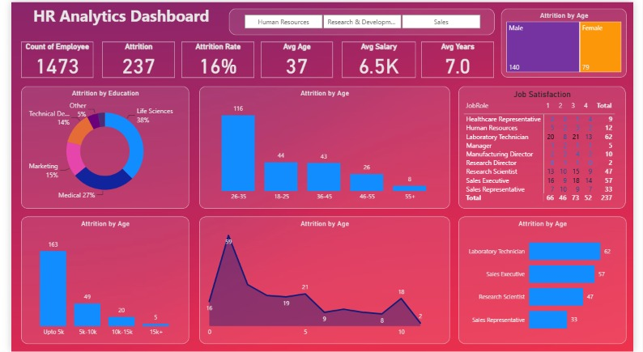

# 📊 HR Analytics – Employee Attrition Prediction

## 🎯 Overview
End-to-end HR analytics project analyzing **1,480 employee records** to identify attrition drivers using Python, machine learning, and Power BI visualization.

---

## 🔍 Problem Statement
High employee attrition impacts recruitment costs and productivity. This project identifies key turnover factors and predicts at-risk employees.

---

## 📂 Project Components

### **1. Data Analysis (Python)**
- Explored 1,480 employee records with 38 attributes
- Performed EDA and statistical correlation analysis
- Identified attrition drivers: salary, job level, tenure, overtime, commute distance

### **2. Predictive Modeling (Machine Learning)**
- Built Logistic Regression model for attrition prediction
- Evaluated using Accuracy, Precision, Recall, F1-Score
- Generated feature importance rankings

### **3. Interactive Dashboard (Power BI)**
- Real-time attrition metrics and KPIs
- Department-wise, role-wise, and salary-band analysis
- Interactive filters for workforce insights

---

## 🔑 Key Findings

| Factor | Impact |
|--------|--------|
| **Salary Range** | Upto 5K: 21.65% attrition vs. 15K+: 3.76% attrition (~6x difference) |
| **Job Level** | Lower job levels correlate with higher turnover |
| **Tenure** | More years at company = lower attrition risk |
| **Overtime** | Employees with overtime show increased attrition |
| **Commute Distance** | Longer distance correlates with higher attrition |

---

## 💡 Recommendations
1. Review compensation structure for entry-level roles
2. Monitor and reduce excessive overtime
3. Strengthen career development pathways
4. Promote flexible work arrangements
5. Implement retention programs for high-risk departments

---

## 🛠️ Tech Stack
- **Python:** Pandas, NumPy, Scikit-learn
- **Visualization:** Matplotlib, Seaborn, Power BI
- **Development:** Jupyter Notebook

---

## 📁 Project Files
- `HR_Analytics.ipynb` – Python analysis & ML modeling
- `HR_Analytics.csv` – Employee dataset (1,480 records)
- `HR_Analytics_Dashboard.pbix` – Power BI dashboard

---

## 🎯 Skills Demonstrated
- Python & Data Analysis (Pandas, NumPy)
- Machine Learning & Classification
- Statistical Analysis & EDA
- Data Visualization (Power BI, Matplotlib, Seaborn)
- Business Intelligence & HR Analytics

---
## Dashboard Preview

---

**Author:** Tanuja  
